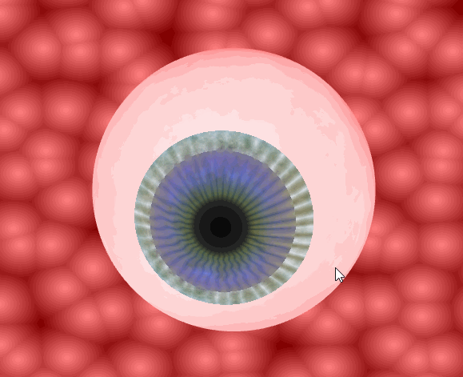
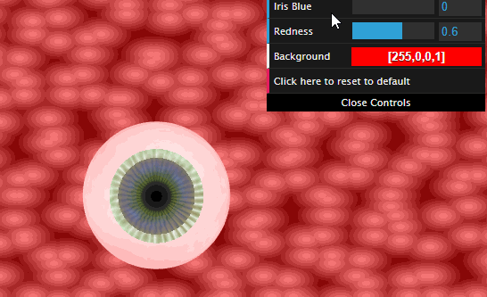
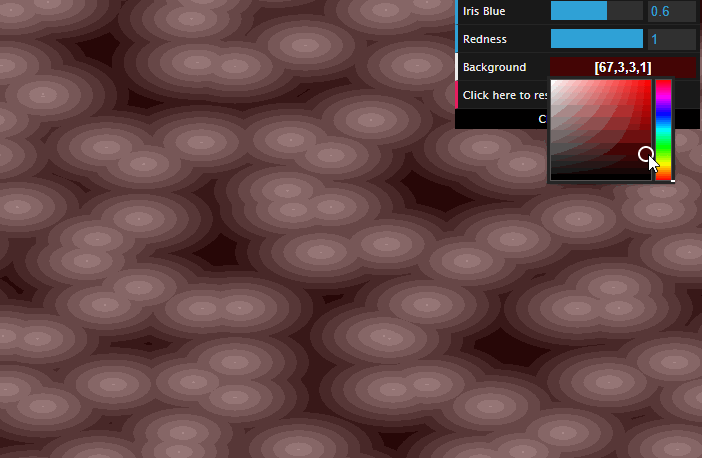
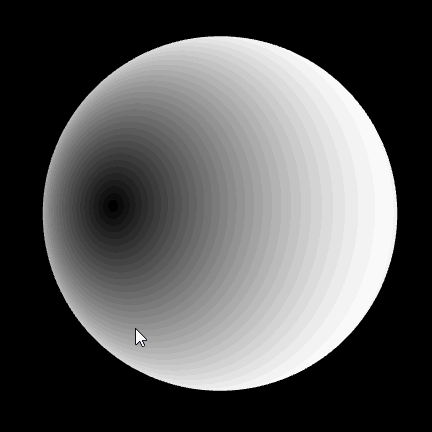
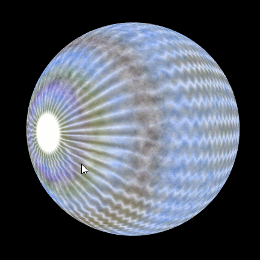
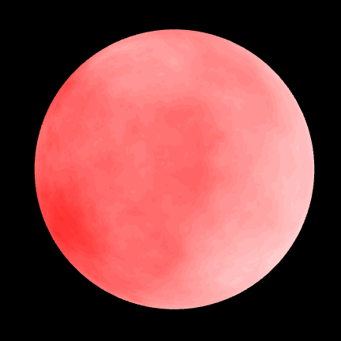

# [Project 1: Noise Functions](https://github.com/CIS-566-Fall-2022/hw01-fireball-base)
Making an eyeball using noise functions - [Click here for live demo](https://632c97460c0c396ccc480d49--peppy-hummingbird-e2f00d.netlify.app/)
---
*Note: some artifacts such as bands/rings which don't appear to be interpolating smoothly in the gifs on README.md are not visible in the live demo.*



## Introduction

Noise functions form the basis of many aesthetically-pleasing graphics creations. A noise function is a seeded random number generator.
- Given some input parameters, returns a random-looking number: y = noise(x)
- Same input parameters will always produce the same output.

In this project, I have used a noise functions like FBM and Worley noise combined with some basic math functionsto generate an eerie looking eyeball. I will describe each of these functions below:

**1. FBM (Multi-Octave Fractal Brownian Motion)** : An FBM noise can be generated using a combination of multiple component frequencies. Each octave contribution can be modulated using frequency(rate of sampling) and persistence(decay of amplitude as frequency increases). I have used FBM noise to distort the blue color of iris and red color of the eyeball. Both these persistence values are parametrized and can be controlled by the user.



**2. Worley Noise** : In this project, I have used Worley noise as an interesting background with time affecting its input parameter

To generate Worley noise,
- Scatter N points randomly in a 2D image
- For every pixel in the image, find the point to which it is closest
- Calculate the distance between the pixel and point, and set the pixel’s brightness to that distance value
- If distance > 1, clamp to 1




## Eyeball in making

### The pupil



The pupil itself mixes black with r(which depends on x and y) and gives more weight to r where ```r = sqrt(x<sup>2</sup> + y<sup>2</sup>);``` where x and y are fragment positions. So when both x and y tend to 0, mixed result shows black.

### The iris



The iris is made up my mixing blue, green and brown FBM distributions using smoothstep. A combination of cos waves with small phase differences generates the lines on the iris. These waves depend on z coordinate of the fragment position, and theta calculated as atan(x,y).

### The eyeball



The eyeball is an FBM noise with 8 octaves which distributes the red color. Combining this with the iris waves generates vein like structures behind the eyeball.


## References

1. UPenn CIS 566 Procedural Graphics course slides
2. UPenn CIS 460 Interactive Computer Graphics course slides
3. [Inigo Quilez website](https://iquilezles.org/)
